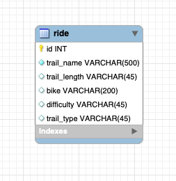

# EventTrackerProject

## Full-Stack Spring/REST/JPA for Skill Distillery

## Overview
User can track rides they've done on a mountain bike. Ride data can include trail name, trail length, bike used, trail difficulty, and trail type.

## REST Endpoints
| Return Type        | Route           | Functionality  |
| ------------- |-------------| -----|
| `List<Ride>`     | `GET api/rides` | Gets all rides |
| `Ride`      | `GET api/rides/{rideId}`      |   Gets a specific ride |
| `Ride` | `POST api/rides`      |    Creates a ride |
| `Ride` | `PUT api/rides`      |    Updates a ride |
| `void` | `DELETE api/rides/{rideId}`      |    Deletes a ride |

## Database Schema

